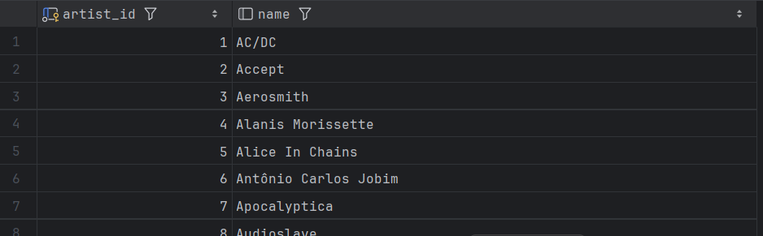
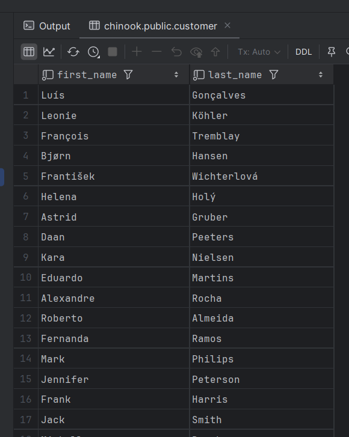
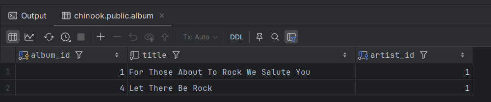
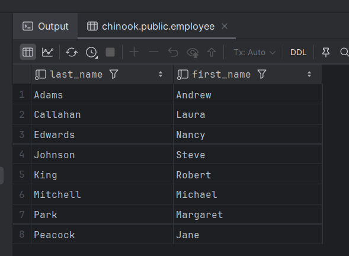
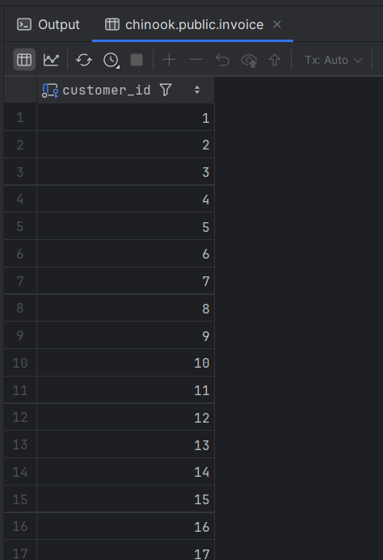
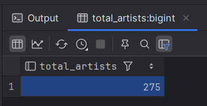
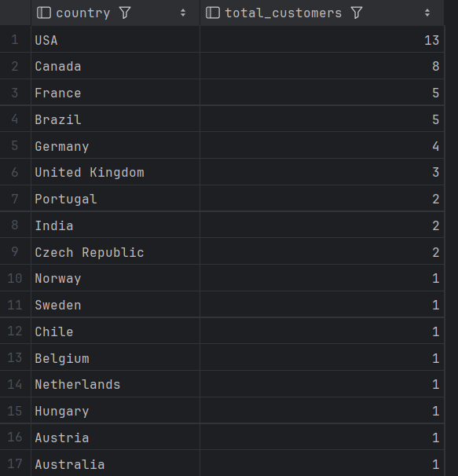

# Consultas SQL en PostgreSQL

Este documento contiene consultas SQL ejecutadas sobre la base de datos de chinook.  
Cada consulta incluye su explicación y un espacio para capturas de pantalla de los resultados.

---

## 1. Seleccionar todos los registros de la tabla artist

```sql
SELECT * FROM artist;
```

Obtiene todas las columnas y filas de la tabla artist.

Resultado:



## 2. Seleccionar nombre y apellido de los primeros 100 clientes
```sql
SELECT first_name, last_name
FROM customer
LIMIT 100;
```
Muestra únicamente las columnas first_name y last_name de la tabla customer, limitando la salida a los primeros 100 registros.

Resultado:



## 3. Seleccionar todos los álbumes del artista con artist_id = 1
```sql
SELECT * FROM album
WHERE artist_id = 1;
```
Filtra los álbumes cuyo artist_id es igual a 1.

Resultado:


## 4. Listar empleados ordenados alfabéticamente por apellido
```sql
SELECT last_name, first_name
FROM employee
ORDER BY last_name ASC;
```
Muestra last_name y first_name de la tabla employee y los ordena alfabéticamente en orden ascendente (ASC) según el apellido.

Resultado:


## 5. Seleccionar los customer_id únicos de facturas (invoice)
```sql
SELECT DISTINCT customer_id
FROM invoice
ORDER BY customer_id;
```
Obtiene una lista de clientes únicos (DISTINCT) que tienen facturas registradas en la tabla invoice.

Resultado:


## 6. Contar el total de artistas
```sql
SELECT COUNT(*) AS total_artists
FROM artist;
```
Cuenta el total de filas en la tabla artist. El resultado devuelve una sola fila con la columna total_artists.

Resultado:


## 7. Número de clientes agrupados por país
```sql
SELECT country, COUNT(*) AS total_customers
FROM customer
GROUP BY country
ORDER BY total_customers DESC;
```
Agrupa a los clientes por country y cuenta cuántos hay en cada país. El resultado se ordena de mayor a menor (DESC).

Resultado:
